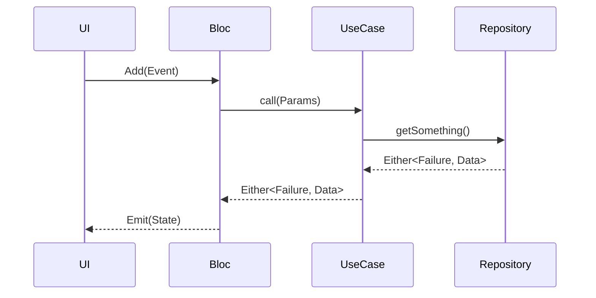

# Clean Architecture Guide

> "Architecture represents the significant design decisions that shape a system, where significant is measured by cost of change." - Grady Booch

## Overview

Project App implements a strict **Clean Architecture** to ensure the codebase remains maintainable, testable, and scalable.

### High-Level Layers

```mermaid
graph TD
    UI[Presentation Layer] -->|Deepends on| D[Domain Layer]
    Data[Data Layer] -->|Deepends on (impl)| D[Domain Layer]
    D -->|Independent| None[Pure Dart]
```

## 1. Domain Layer (The Core)

**Path**: `lib/features/<feature>/domain`

This is the innermost layer. It contains the business logic and is completely independent of external libraries, frameworks (including Flutter), or data sources.

### Components
- **Entities**: Pure Dart classes representing business objects.
- **Use Cases**: Encapsulate a specific business rule or action (e.g., `LoginUser`, `GetTransactions`).
- **Repository Interfaces**: Abstract classes defining the contract for data operations.

### ⛔ Rules
- **NO Flutter dependencies** (e.g., no `BuildContext`, no UI widgets).
- **NO Data layer dependencies** (e.g., no `http`, no `shared_preferences`, no JSON parsing).
- **Must be 100% tested**.

## 2. Data Layer (The Output)

**Path**: `lib/features/<feature>/data`

This layer is responsible for retrieving and storing data. It implements the interfaces defined in the Domain layer.

### Components
- **Models**: DTOs (Data Transfer Objects) that extend Entities and handle JSON serialization (`.fromJson`, `.toJson`).
- **Data Sources**: Low-level data access (Remote vs Local).
- **Repositories**: Implement `Domain` repositories. They coordinate data sources (e.g., check cache, then fetch network).

### ⛔ Rules
- **Must implement Domain interfaces**.
- **Should manage exceptions** and map them to Domain `Failures`.

## 3. Presentation Layer (The Input)

**Path**: `lib/features/<feature>/presentation`

This layer is responsible for showing data to the user and capturing user commands.

### Components
- **BLoC / Cubit**: Manages state using the `flutter_bloc` library.
- **Pages / Screens**: Top-level widgets.
- **Widgets**: Reusable UI components.

### ⛔ Rules
- **"Dumb UI"**: Widgets should only display state and dispatch events.
- **No Business Logic**: All logic moves to BLoC or Use Cases.
- **Never call Repositories directly**: Always use Use Cases via BLoC.

## Dependency Injection

We use `get_it` and `injectable` to manage dependencies.

```dart
// main.dart calls:
configureDependencies();

// Inside BLoC
class MyBloc extends Bloc {
  final MyUseCase useCase;
  MyBloc(this.useCase); 
}
```

## BLoC Pattern Usage

Events flow in, States flow out.


