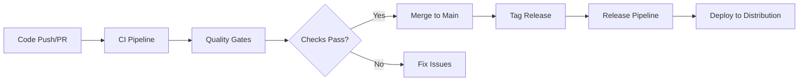

# Deployment Guide

## Overview

This guide covers the CI/CD pipeline architecture, deployment processes, and troubleshooting for Project App.

## Table of Contents

- [Pipeline Architecture](#pipeline-architecture)
- [Environment Setup](#environment-setup)
- [Secret Management](#secret-management)
- [Build Flavors](#build-flavors)
- [Release Process](#release-process)
- [Troubleshooting](#troubleshooting)
- [Emergency Rollback](#emergency-rollback)

---

## Pipeline Architecture

Project App uses GitHub Actions for CI/CD automation with three primary workflows:



### Workflows

#### 1. **Continuous Integration** (`.github/workflows/ci.yml`)

Runs on every push and pull request to main/develop branches.

**Jobs:**
- **Code Quality**: Format check, static analysis
- **Testing**: Unit tests, widget tests, coverage reporting
- **Build Verification**: Android APK, iOS build (no codesign)

**Triggers:**
- Push to main, develop, feature/*, bugfix/*
- Pull requests to main, develop

---

#### 2. **Release Automation** (`.github/workflows/release.yml`)

Triggered by semantic version tags (e.g., `v1.0.0`).

**Jobs:**
- **Validate Tag**: Ensure semantic versioning format
- **Build Android Release**: AAB and APK with signing
- **Build iOS Release**: Placeholder for future implementation
- **Create GitHub Release**: Auto-generated release notes

**Triggers:**
- Tags matching pattern: `v*.*.*` (e.g., v1.0.0, v2.1.3)

---

#### 3. **Quality Gate Enforcement** (`.github/workflows/quality-gate.yml`)

Additional quality checks on PRs and main/develop pushes.

**Jobs:**
- **Code Coverage**: Threshold enforcement (future)
- **Complexity Analysis**: Cyclomatic complexity checks
- **TODO Detection**: Scan for TODO/FIXME comments
- **Dependency Security**: Vulnerability scanning
- **License Compliance**: Generate license reports

---

## Environment Setup

### Prerequisites

1. **Flutter Installation**
   ```bash
   flutter --version
   # Ensure Flutter 3.30.1 or higher
   ```

2. **Android SDK**
   ```bash
   flutter doctor
   # Ensure Android SDK 35 is installed
   ```

3. **Java 17**
   ```bash
   java -version
   # Required for Android builds
   ```

### Local Development Setup

1. **Clone Repository**
   ```bash
   git clone https://github.com/dinesh-hannurkar/app-application.git
   cd app
   ```

2. **Install Dependencies**
   ```bash
   flutter pub get
   ```

3. **Configure Environment**
   ```bash
   # Copy environment template
   cp .env.example .env
   
   # Edit .env with your configuration
   nano .env
   ```

4. **Verify Installation**
   ```bash
   flutter analyze
   flutter test
   flutter build apk --debug
   ```

---

## Secret Management

### Required Secrets

Configure these secrets in GitHub repository settings:

#### Android Signing

| Secret Name | Description |
|------------|-------------|
| `ANDROID_KEYSTORE_BASE64` | Base64-encoded keystore file |
| `ANDROID_KEYSTORE_PASSWORD` | Keystore password |
| `ANDROID_KEY_ALIAS` | Key alias |
| `ANDROID_KEY_PASSWORD` | Key password |

#### Firebase Configuration (Future)

| Secret Name | Description |
|------------|-------------|
| `FIREBASE_CONFIG_DEV` | Firebase config for dev environment |
| `FIREBASE_CONFIG_STAGING` | Firebase config for staging |
| `FIREBASE_CONFIG_PROD` | Firebase config for production |

### Creating Android Keystore

1. **Generate Keystore**
   ```bash
   keytool -genkey -v -keystore ~/app-release-key.jks \
     -keyalg RSA -keysize 2048 -validity 10000 \
     -alias app-key
   ```

2. **Encode for GitHub Secrets**
   ```bash
   # macOS/Linux
   base64 -i ~/app-release-key.jks | pbcopy
   
   # Windows
   certutil -encode app-release-key.jks app-release-key.txt
   ```

3. **Add to GitHub Secrets**
   - Navigate to: Repository → Settings → Secrets and variables → Actions
   - Click "New repository secret"
   - Add each secret listed above

### Local Signing Configuration

1. **Copy Template**
   ```bash
   cp android/key.properties.example android/key.properties
   ```

2. **Edit Configuration**
   ```properties
   storeFile=/path/to/app-release-key.jks
   storePassword=your_keystore_password
   keyAlias=app-key
   keyPassword=your_key_password
   ```

3. **Verify .gitignore**
   ```bash
   # Ensure key.properties is ignored
   grep "key.properties" .gitignore
   ```

> [!CAUTION]
> **NEVER commit key.properties or keystore files to version control!**

---

## Build Flavors

Project App supports three build flavors for different environments:

### Available Flavors

| Flavor | Application ID | Purpose |
|--------|---------------|---------|
| **dev** | `com.app.app.dev` | Development testing |
| **staging** | `com.app.app.staging` | Pre-production validation |
| **prod** | `com.app.app` | Production release |

### Building with Flavors

```bash
# Development
flutter build apk --flavor dev --debug
flutter run --flavor dev

# Staging
flutter build apk --flavor staging --release
flutter run --flavor staging

# Production
flutter build apk --flavor prod --release
flutter build appbundle --flavor prod --release
```

### Flavor Configuration

Each flavor has:
- Unique application ID (allows side-by-side installation)
- Custom app name (e.g., "App Dev")
- Environment-specific configuration

---

## Release Process

### Step-by-Step Release

1. **Ensure Main Branch is Clean**
   ```bash
   git checkout main
   git pull origin main
   ```

2. **Run Pre-Release Checks**
   ```bash
   flutter clean
   flutter pub get
   flutter analyze
   flutter test
   flutter build apk --release --flavor prod
   ```

3. **Create Release Tag**
   ```bash
   # Tag format: vMAJOR.MINOR.PATCH
   git tag v1.0.0
   git push origin v1.0.0
   ```

4. **Monitor GitHub Actions**
   - Navigate to: Repository → Actions
   - Watch the "Release Automation" workflow
   - Verify all jobs complete successfully

5. **Verify Release Assets**
   - Navigate to: Repository → Releases
   - Download and test AAB/APK files
   - Review auto-generated release notes

6. **Deploy to Distribution**
   (Future: Firebase App Distribution / Google Play)

### Versioning Guidelines

Follow **Semantic Versioning** (MAJOR.MINOR.PATCH):

- **MAJOR**: Incompatible API changes
- **MINOR**: New functionality (backwards-compatible)
- **PATCH**: Bug fixes (backwards-compatible)

Examples:
- `v1.0.0` - Initial release
- `v1.1.0` - Added new feature
- `v1.1.1` - Fixed bug in v1.1.0
- `v2.0.0` - Breaking changes

---

## Troubleshooting

### Common CI Failures

#### 1. Format Check Failed

**Error:**
```
dart format --set-exit-if-changed .
Error: Files are not formatted correctly
```

**Fix:**
```bash
dart format .
git add .
git commit -m "chore: format code"
git push
```

---

#### 2. Static Analysis Errors

**Error:**
```
flutter analyze --fatal-infos
Error: Missing return type for function
```

**Fix:**
- Review analysis output
- Fix linting errors in reported files
- Run `flutter analyze` locally before pushing

---

#### 3. Test Failures

**Error:**
```
flutter test
Error: Expected: <5>, Actual: <4>
```

**Fix:**
- Run tests locally: `flutter test`
- Fix failing tests
- Ensure tests pass before pushing

---

#### 4. Build Failures

**Error:**
```
flutter build apk --debug
Error: Could not resolve dependencies
```

**Fix:**
```bash
flutter clean
flutter pub get
flutter pub upgrade
flutter build apk --debug
```

---

### Keystore Issues

#### Missing Keystore in CI

**Error:**
```
Error: signingConfig release requires keystore
```

**Fix:**
- Verify `ANDROID_KEYSTORE_BASE64` secret is set
- Verify other signing secrets are configured
- Check secret names match workflow file

---

#### Invalid Keystore Password

**Error:**
```
Error: Keystore was tampered with, or password was incorrect
```

**Fix:**
- Verify `ANDROID_KEYSTORE_PASSWORD` matches actual password
- Re-encode and upload keystore if necessary

---

## Emergency Rollback

### Rolling Back a Release

1. **Identify Last Good Release**
   ```bash
   git tag
   # Find previous stable tag (e.g., v1.0.0)
   ```

2. **Create Hotfix Branch**
   ```bash
   git checkout -b hotfix/rollback-v1.0.1 v1.0.0
   ```

3. **Tag Rollback Release**
   ```bash
   git tag v1.0.2
   git push origin v1.0.2
   ```

4. **Monitor Release Pipeline**
   - Verify release build succeeds
   - Test rolled-back version

5. **Communicate Rollback**
   - Update release notes
   - Notify team and stakeholders

---

## Branch Protection Rules

### Recommended Settings

Configure in GitHub: Repository → Settings → Branches → Branch protection rules

**For `main` branch:**
- ✅ Require pull request reviews (at least 1)
- ✅ Require status checks to pass:
  - Code Quality & Analysis
  - Unit & Widget Tests
  - Build Android APK
- ✅ Require branches to be up to date
- ✅ Do not allow force pushes
- ✅ Do not allow deletions

**For `develop` branch:**
- ✅ Require status checks to pass
- ✅ Require branches to be up to date

---

## Monitoring and Logs

### Viewing CI Logs

1. Navigate to: Repository → Actions
2. Select workflow run
3. Click on job to view detailed logs
4. Download logs for offline analysis

### Build Artifacts

- **Location**: GitHub Actions → Workflow Run → Artifacts
- **Retention**: 7 days (CI builds), 30 days (releases)
- **Available Artifacts**:
  - debug-apk (CI builds)
  - release-aab (Release builds)
  - release-apk (Release builds)
  - coverage reports
  - license reports

---

## Best Practices

1. **Always test locally before pushing**
   ```bash
   flutter analyze && flutter test && flutter build apk --debug
   ```

2. **Use conventional commits**
   ```bash
   git commit -m "feat: add user authentication"
   git commit -m "fix: resolve login crash"
   git commit -m "chore: update dependencies"
   ```

3. **Keep dependencies up to date**
   ```bash
   flutter pub outdated
   flutter pub upgrade --major-versions
   ```

4. **Review CI logs regularly**
   - Monitor for flaky tests
   - Watch for security vulnerabilities
   - Track build times

5. **Never commit secrets**
   - Use .env files (gitignored)
   - Use GitHub Secrets for CI/CD
   - Rotate keys regularly

---

## Support

For issues with CI/CD or deployment:

1. Check this guide first
2. Review GitHub Actions logs
3. Consult `docs/devops/environment-config.md`
4. Contact DevOps Infrastructure role

---

**Role**: DevOps Infrastructure  
**Last Updated**: 2026-01-22  
**Version**: 1.0
