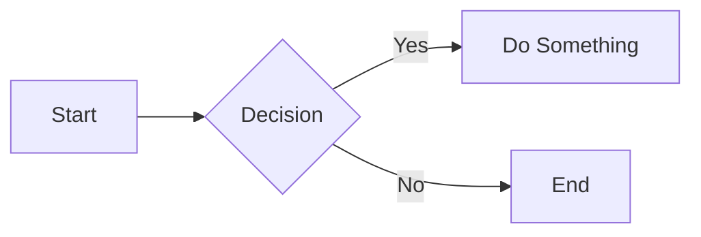

# Documentation Standards

Clear documentation is as important as clean code.

## 1. General Guidelines
- **Language**: English (US).
- **Tone**: Professional, concise, and helpful.
- **Format**: Markdown (`.md`).

## 2. In-Code Documentation (DartDoc)

All public classes and methods **must** have documentation comments (`///`).

### Format
1. **Summary**: One-line description.
2. **Details**: Detailed explanation (optional).
3. **Parameters**: `@param` (implicitly handled by DartDoc).
4. **Returns**: Description of return value.
5. **Throws**: What exceptions might be thrown.

```dart
/// Calculates the total price including tax.
///
/// Uses the current tax rate configured in [TaxConfig].
///
/// Throws [InvalidTaxException] if calculation fails.
double calculateTotal(double subtotal) { ... }
```

## 3. Markdown Files

### Headers
Use `#` for titles, `##` for main sections, `###` for subsections.

### Links
- Use relative paths for internal links: `[Architecture](../architecture/clean-architecture.md)`.
- Use absolute URLs for external links.

### Diagrams
Use **Mermaid** for diagrams.



## 4. API Documentation

- Endpoint documentation should use the standard template.
- Version history must be maintained.

## 5. Maintenance

- **Documentation Owner** is responsible for periodic reviews.
- Outdated documentation is treated as a bug.
